# README

## Navigation-for-Mapping-using-Reinforcement-Learning
Assignment of the course Introduction to Intelligent Robotics (3rd year, 2nd semester)

## A little context
### Overview
The aim of this project was to develop a mobile robot that must build a map of an unknown environment using a LiDAR reading. The goal is to use reinforcement learning (RL) models to control how the robot should move so that all of the environment gets mapped. It is assumed that the environment is static (i.e. no moving objects). 

### The environment chosen's characteristics
#### Action Space
Actions are the linear and angular velocitites.
#### Rewards
Reward is given for every map completly explored and for neutral behaviour. 
Penalties are given if there is a collision or if the robot gets to close to the walls
#### States
The initial state places the robot on a random wall-free spot on the world (to avoid overfitting). Episodes end if the robot can map the entire world.
#### Percepts (Observations)
Observations include various details such as collision sensor's and Lidar sensor's output and the occupancy map.
#### RL algorithms chosen
* PPO
* SAC
* A2C
* TD3

### Simulation Maps
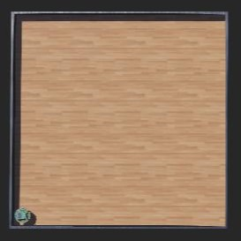
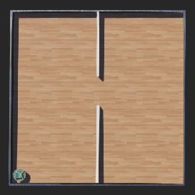
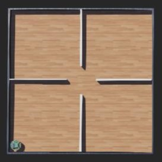
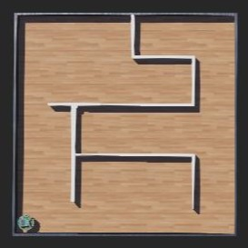
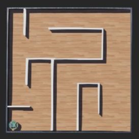
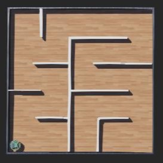

### Training Process
During training, it’s also possible to monitor the robot’s behavior in Webots in real-time, observing the robot’s interactions with the environment and visualizing the maps it generates and saves as it explores.

  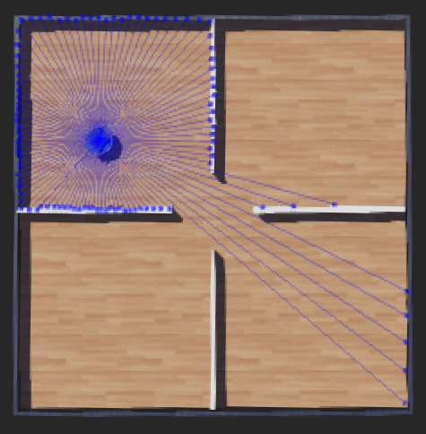
  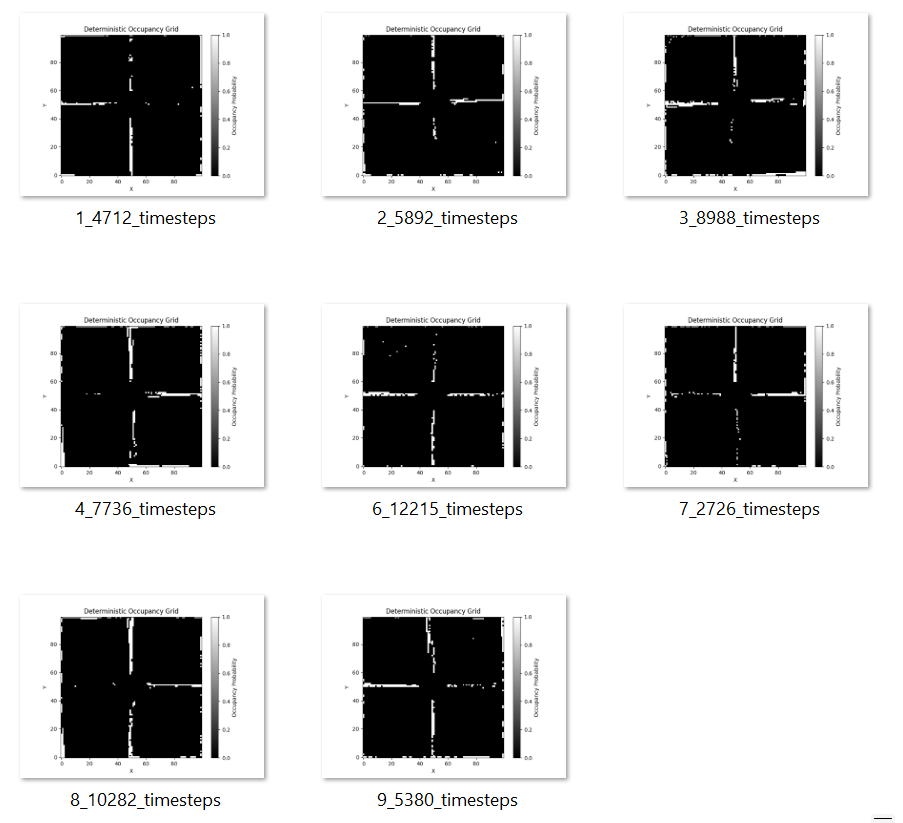

### Experimental Results - on tensorboard
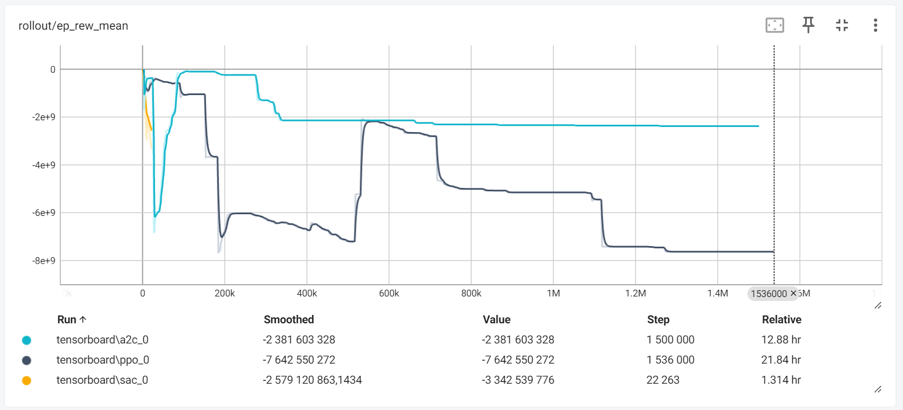

#### Test Results
After training, tests were made on a map (map6) of increased difficulty.

  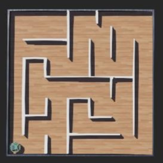

The tests were conducted only with PPO and A2C once these were the only algorithms which manage to complete training. 
The following maps are the results of that test phase.
##### PPO and A2C (respectively)

  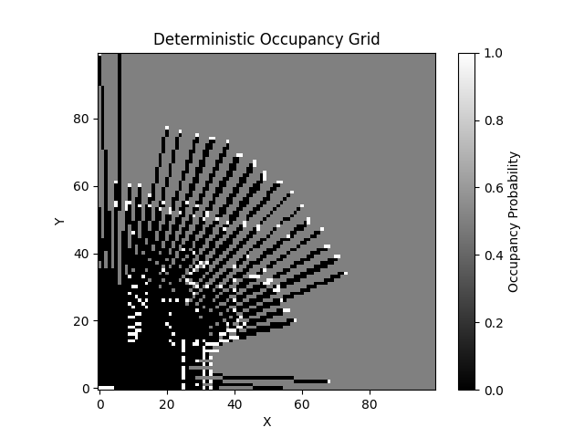
  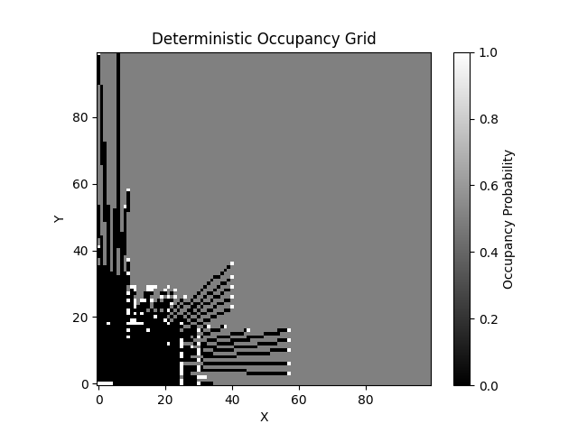

### Conclusion

The training phase results revealed that PPO and A2C outperformed SAC
and TD3 in terms of the number of maps completed. PPO exhibited a more
aggressive exploration strategy, completing a significant number of maps but
with a high degree of variability in performance, as evidenced by the reward
trends. A2C, while completing fewer maps, showed more consistent performance,
maintaining stability across the training sessions. SAC and TD3 struggled with
the complexity of the maps, failing to complete any beyond the initial stages.
In the test phase, both PPO and A2C were evaluated on an unseen map. The
occupancy grids generated during this phase underscored the differences in their
exploration strategies. PPO’s broader exploration allowed it to cover more area,
potentially enabling it to adapt better to new environments. A2C, on the other
hand, maintained a more focused exploration pattern, reflecting its conservative
approach observed during training.
Despite the promising results, there are several areas for improvement to en-
hance the performance of RL algorithms in robotic navigation tasks. Fine-tuning
the reward structure could significantly impact the learning efficiency and effec-
tiveness. Providing more granular feedback for intermediate goals or penalizing
unnecessary movements could help in optimizing the learning process. Extending
the number of timesteps in training could allow the algorithms to explore more
thoroughly and develop a deeper understanding of the environment, potentially
improving performance on more complex maps. Incorporating advancements in
RL algorithms, such as hybrid models that combine the strengths of different ap-
proaches, could yield better performance. Employing cross-validation techniques
to test the algorithms on a variety of unseen maps during training could also
provide a more robust assessment of their generalization capabilities.
In conclusion, while PPO and A2C have shown promising results in robotic
navigation tasks, there is substantial room for improvement. By addressing the
outlined areas, the performance and reliability of RL algorithms can be en-
hanced, paving the way for more effective and adaptive robotic systems. This
study serves as a foundation for future research aimed at refining these algo-
rithms and expanding their applicability in complex real-world environments.

## Files
- **a2c_main.py**: Implementation of the A2C (Advantage Actor-Critic) algorithm for training the navigation agent.
- **ppo_main.py**: Implementation of the PPO (Proximal Policy Optimization) algorithm for training the navigation agent.
- **sac_main.py**: Implementation of the SAC (Soft Actor-Critic) algorithm for training the navigation agent.
- **td3_main.py**: Implementation of the TD3 (Twin Delayed Deep Deterministic Policy Gradient) algorithm for training the navigation agent.
- **environment.py**: Definition of the simulation environment where the navigation agent interacts.
- **map.py**: Includes class DeterministicOccupancyGrid that represents a deterministic occupancy grid map.
- **occupancy_grid.py**: Occupancy Grid base class (By: Gonçalo Leão).
- **transformations.py**: Functions for working with 3D transformations (By: Gonçalo Leão).
- **utils.py**: Functions for Webots and for working with the epuck robot (By: Gonçalo Leão).
- **images_timesteps.py**: Script to calculate the average number of timesteps for each method and map.
- **instructions.txt**: File containing instructions to run the code.
- **settings.py**: Set of reward constants for RL's algorithms.
- **test.py**: Script for testing the performance of trained models in a given environment.
- **maps_images/**: Folder containing images of the generated maps while training.
- **models/**: Folder containing trained models. (The SAC model is missing due to its large size)
- **tensorboard/**: Folder containing TensorBoard logs.
- **test_maps/**: Folder containing generated maps during test.
